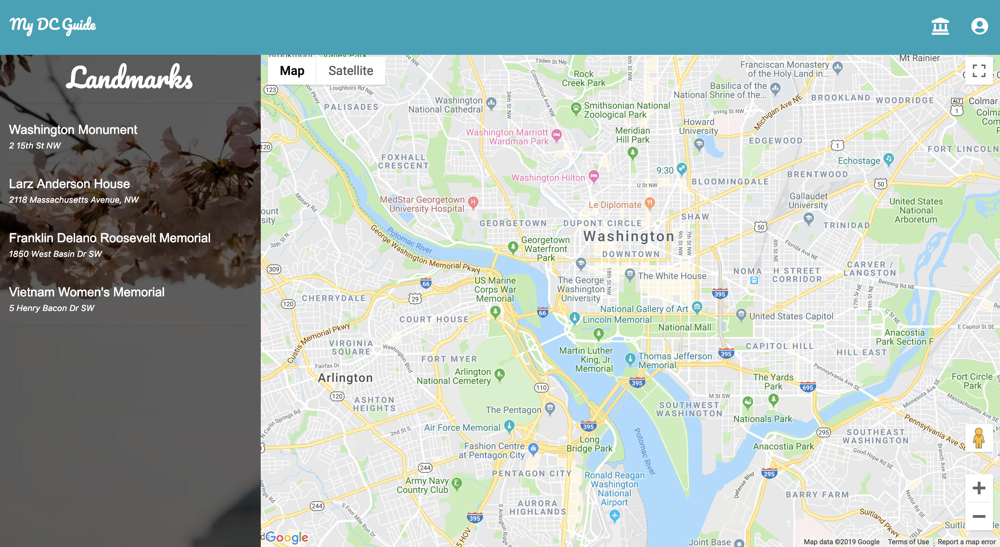
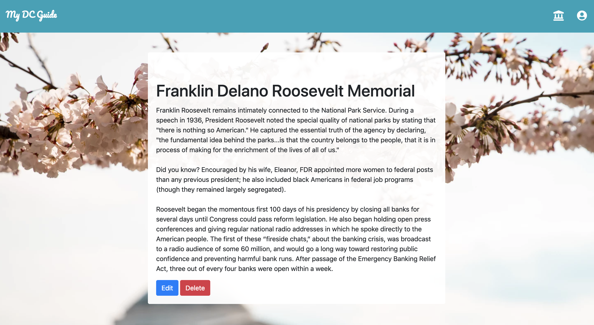

# My DC Tour

My DC Tour is an app for people interested in exploring the DC area and all it has to offer, but don't know where to start. You can scroll through a list of landmarks and read all about them all in one place. You can also add new landmarks to the list, and create a customized tour for yourself, your family, or your friends visiting the city. 

## Features

This application uses bootstrap for layout formatting. 

The image below shows the home screen. I used the Google Maps Javascript API to generate a map centered and zoomed in on the DC area.

On the left side, there is a list of landmarks and their address. In a future version, I'd like to import these locations to the map so they are highlighted whenever clicked on. 

When a landmark is clicked, the browser will render a page that shows the landmark and the description. Here, a user will have the option to update or delete the landmark. 

Users can create a new landmark by clicking on the building icon.

To view, create, delete and update tours, a user will click on the profile icon in the upper right corner of the navigation bar.

## Functionality

- Two models: Landmark and Tour
- Display all Landmarks on home page and render map of the DC area
- View a single Landmark 
- Edit and Delete a single Landmark
- Display all Tours on the tours/ page
- View a single tour and delete a tour

## Technologies Used 

- Google Maps 
- MEHN (MongoDB, Express, Handlebars, and Node.js)
- Bootstrap used for layout
- Bootsnip.com used for some of the bootstrap elements as well
- Future versions will use passport for authentication

## Next Phase

- Build out the User model and controllers
- Add login, signup, and authentication
- Reconfigure Google Maps API so key is hidden
- Add geolocation for landmarks and import to map
- Add edit method to tours
